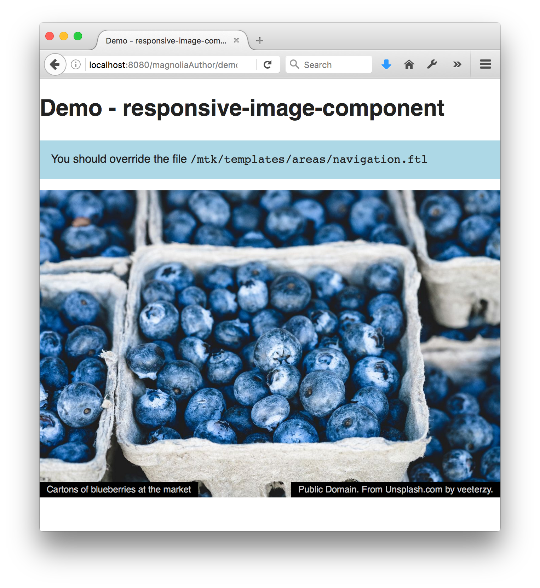

# Responsive Image - Component template for Magnolia CMS #

In a responsive web design, images typically change size with the width of the browser.
This component ensures that the image rendition that is loaded is both large enough to supply the highest quality, and the smallest that will suffice.
It does this with the help of the lazysizes javascript library.

This component is based on the Magnolia Templating Kit (MTK) image component. It would be easy to adapt the TextImage component to have a responsive image in the same way.

## Features ##
* Chooses the best image rendition for the currently displayed image size on the page.
* Lazily loads images - that is, only loads images that are scrolled onto the page.
* Load new image renditions as necessary when the page is resized.
* Graceful fallback if javascript is disabled.

## Usage ##
Use this component as is, or simply as a starting point or inspiration for how to accomplish this common task.
The real 'action' is in /templates/macros/responsiveImageLazySizes.ftl.

* Include the webresources/libs/lazysizes.min.js on your pages.
* Include the webresources/css/responsive-image.css on your pages.
* Customize the macro in /templates/macros/responsiveImageLazySizes.ftl (responsiveImageConfigured) as desired.
* Include those renditions in your site theme that are listed in the above mentioned macro (So that magnolia knows how to generate the proper renditions)
* Make the component available to your pages.
* Add the component to your page.

Tip - the theme definition supplied in /themes/demo-responsive-image-component.yaml shows the proper rendition configuration. You could integrate these values into your theme - or directly reference this theme in your site.

## Demo ##
To see an example page demonstrating this component:
* Open the Assets app in Magnolia AdminCentral and import the file in 'importsSamples/dam.demo-responsive-image-component.xml'.
* Open the Pages app in Magnolia AdminCentral and import the file in 'importsSamples/website.demo-responsive-image.xml'.

## Dependencies ##
* Lazy Sizes - https://github.com/aFarkas/lazysizes

## Information on Magnolia CMS
https://docs.magnolia-cms.com

This directory is a 'light module'.
https://documentation.magnolia-cms.com/display/DOCS/Light+development+in+Magnolia

## Contribute to the Magnolia component ecosystem
It's easy to create components for Magnolia and share them on github and npm. I invite you to do so and join the community. Let's stop wasting time by developing the same thing again and again, rather let's help each other out by sharing our work and create a rich library of components.

Just add magnolia-light-module and magnolia-component as keywords to the package.json to make them easy to find and use.

## Notes
* This is not officially supported Magnolia CMS code. This is a community contribution.
* Your input is welcome! Just file a ticket, or create a pull request on github.

## License

MIT

## Contributors

Christopher Zimmermann, @topherzee
